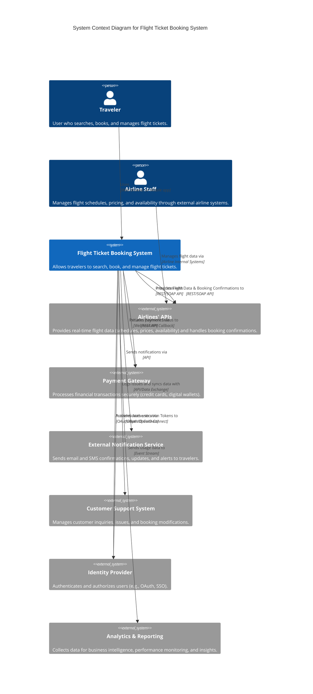

This C4 architecture overview describes a "Flight Ticket Booking System" (Бронирование билетов на самолет).

### High-Level Architecture Decisions

1.  **Cloud-Native & Scalability:** The system will be designed to run on a public cloud platform (e.g., AWS, Azure, GCP), leveraging managed services for compute, database, and messaging to ensure high availability, elasticity, and operational efficiency. This allows for dynamic scaling to handle peak loads during travel seasons.
2.  **Microservices Architecture:** The system will be decomposed into a set of loosely coupled, independently deployable microservices. This promotes agility, allows for technology diversity, and enhances resilience by isolating failures. Services will communicate primarily via well-defined APIs and asynchronous messaging.
3.  **API-First Design:** All external and internal interactions will be facilitated through RESTful APIs. An API Gateway will serve as the single entry point for external consumers, providing security, routing, and rate limiting.
4.  **Event-Driven Communication:** Asynchronous communication using a message broker (e.g., Kafka, RabbitMQ, SQS) will decouple services, enabling reactive patterns and improving system responsiveness and resilience, especially for non-real-time processes like notifications or analytics.
5.  **Robust Data Management:** A combination of relational databases (for transactional data like bookings and payments, ensuring strong consistency) and NoSQL databases (for highly scalable data like cached flight information or user preferences) will be used. Data security and integrity are paramount.
6.  **Security by Design:** Comprehensive security measures will be integrated at every layer, including robust authentication and authorization (leveraging an Identity Provider), data encryption in transit and at rest, input validation, and regular security audits.
7.  **User Experience (UX) Focus:** The frontend applications (web and mobile) will be designed for intuitive navigation, speed, and responsiveness, ensuring a seamless booking experience for travelers.

---

### 1. C4 System Context Diagram

This diagram illustrates how the "Flight Ticket Booking System" interacts with its users and other major external systems.

---

### 2. C4 Container Diagram

This diagram shows the high-level containers (applications and data stores) within the "Flight Ticket Booking System" and how they interact.

```mermaid
C4Container
    title Container Diagram for Flight Ticket Booking System

    Person(traveler, "Traveler", "User who searches, books, and manages flight tickets.")

    System_Ext(airline_apis, "Airlines' APIs", "Provides real-time flight data and booking.")
    System_Ext(payment_gateway, "Payment Gateway", "Processes financial transactions securely.")
    System_Ext(external_notification_service, "External Notification Service", "Sends email/SMS notifications.")
    System_Ext(identity_provider, "Identity Provider", "Authenticates and authorizes users.")

    Container(web_app, "Web Application", "React/Angular SPA", "Provides a rich user interface for travelers via web browser.")
    Container(mobile_app, "Mobile Application", "iOS/Android App", "Native applications for travelers to book and manage flights.")
    Container(api_gateway, "API Gateway", "AWS API Gateway/Nginx", "Routes requests to appropriate microservices, handles authentication, and rate limiting.")

    Container(user_service, "User Service", "Spring Boot Microservice", "Manages user profiles, authentication, and authorization details.")
    Container(flight_search_service, "Flight Search Service", "Node.js Microservice", "Handles flight search requests, aggregates data from Airlines' APIs, and caches results.")
    Container(booking_service, "Booking Service", "Python Microservice", "Manages the flight booking lifecycle, seat selection, and booking confirmations.")
    Container(payment_service, "Payment Service", "Java Microservice", "Manages payment initiation, status updates, and integrates with Payment Gateway.")
    Container(notification_processor, "Notification Processor", "Serverless Function/Kafka Consumer", "Processes events to trigger notifications via the external notification service.")

    Container(booking_db, "Booking Database", "PostgreSQL Database", "Stores transactional booking data, passenger details, and payment statuses.")
    Container(user_db, "User Database", "MongoDB NoSQL Database", "Stores user profiles, preferences, and authentication links.")
    Container(flight_cache_db, "Flight Cache Database", "Redis Cache", "Caches flight search results and availability for performance.")
    Container(message_broker, "Message Broker", "Kafka/RabbitMQ", "Facilitates asynchronous communication and event streaming between services.")

    Rel(traveler, web_app, "Uses", "HTTPS")
    Rel(traveler, mobile_app, "Uses", "HTTPS/Mobile Network")
    Rel(web_app, api_gateway, "Makes API calls to", "HTTPS")
    Rel(mobile_app, api_gateway, "Makes API calls to", "HTTPS")

    Rel(api_gateway, user_service, "Authenticates users via", "API")
    Rel(api_gateway, flight_search_service, "Requests flight searches from", "API")
    Rel(api_gateway, booking_service, "Requests booking and management from", "API")
    Rel(api_gateway, payment_service, "Initiates payments via", "API")

    Rel(user_service, user_db, "Reads/Writes user data to", "JDBC/ORM")
    Rel(user_service, identity_provider, "Delegates authentication to", "OAuth/OpenID Connect")

    Rel(flight_search_service, airline_apis, "Fetches real-time flight data from", "REST/SOAP API")
    Rel(flight_search_service, flight_cache_db, "Reads/Writes flight data to", "Redis API")

    Rel(booking_service, flight_search_service, "Confirms flight details with", "API")
    Rel(booking_service, booking_db, "Reads/Writes booking data to", "JDBC/ORM")
    Rel(booking_service, message_broker, "Publishes booking events to", "Async Message")

    Rel(payment_service, booking_db, "Updates payment status in", "JDBC/ORM")
    Rel(payment_service, payment_gateway, "Processes payments with", "REST API")
    Rel(payment_service, message_broker, "Publishes payment events to", "Async Message")

    Rel(notification_processor, message_broker, "Subscribes to booking and payment events from", "Async Message")
    Rel(notification_processor, external_notification_service, "Sends notifications via", "API")

    Rel_Back(airline_apis, flight_search_service, "Provides Flight Data to", "REST/SOAP API")
    Rel_Back(payment_gateway, payment_service, "Returns Payment Status to", "Webhook/API Callback")
    Rel_Back(identity_provider, user_service, "Provides Authentication Tokens to", "OAuth/OpenID Connect")
    Rel_Back(external_notification_service, notification_processor, "Confirms Notification Delivery to", "API/Callback (Optional)")
```

