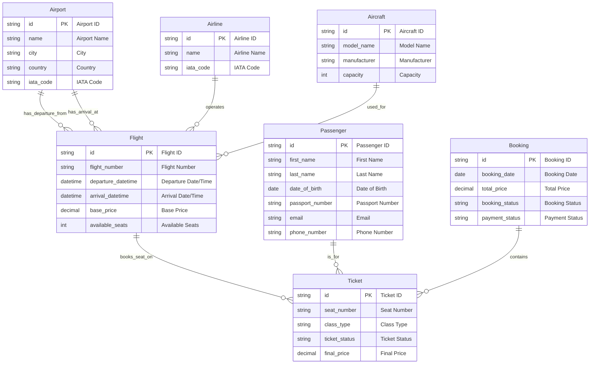

Here's a conceptual data model for "Бронирование билетов на самолет" (Airplane Ticket Booking).

### 1. Textual Description of Entities and Relationships

**Entities:**

*   **Airport:** Represents a physical airport location.
    *   **Attributes:** Airport ID (Primary Key), Name, City, Country, IATA Code.
*   **Airline:** Represents an airline company.
    *   **Attributes:** Airline ID (Primary Key), Name, IATA Code.
*   **Aircraft:** Represents a specific type of airplane model.
    *   **Attributes:** Aircraft ID (Primary Key), Model Name, Manufacturer, Capacity.
*   **Flight:** Represents a scheduled flight between two airports on a specific date and time.
    *   **Attributes:** Flight ID (Primary Key), Flight Number, Departure DateTime, Arrival DateTime, Price (base), Available Seats.
*   **Passenger:** Represents an individual person who will be flying.
    *   **Attributes:** Passenger ID (Primary Key), First Name, Last Name, Date of Birth, Passport Number, Email, Phone Number.
*   **Booking:** Represents a reservation made by a customer, which can include one or more tickets for different passengers and/or flights.
    *   **Attributes:** Booking ID (Primary Key), Booking Date, Total Price, Booking Status (e.g., Confirmed, Pending, Cancelled), Payment Status.
*   **Ticket:** Represents a single ticket for a specific passenger on a specific flight within a booking. This is an associative entity linking Passengers, Flights, and Bookings.
    *   **Attributes:** Ticket ID (Primary Key), Seat Number, Class (e.g., Economy, Business), Ticket Status (e.g., Issued, Used, Cancelled), Price (final, specific to this ticket).

**Relationships:**

*   **Airport - Flight (Departure):** An `Airport` serves as the departure location for many `Flights`. A `Flight` has exactly one departure `Airport`.
    *   *Cardinality:* One-to-Many (1:M)
*   **Airport - Flight (Arrival):** An `Airport` serves as the arrival location for many `Flights`. A `Flight` has exactly one arrival `Airport`.
    *   *Cardinality:* One-to-Many (1:M)
*   **Airline - Flight:** An `Airline` operates many `Flights`. A `Flight` is operated by exactly one `Airline`.
    *   *Cardinality:* One-to-Many (1:M)
*   **Aircraft - Flight:** An `Aircraft` model can be used for many `Flights`. A `Flight` is assigned to exactly one `Aircraft` model.
    *   *Cardinality:* One-to-Many (1:M)
*   **Booking - Ticket:** A `Booking` can contain one or many `Tickets`. A `Ticket` belongs to exactly one `Booking`.
    *   *Cardinality:* One-to-Many (1:M)
*   **Passenger - Ticket:** A `Passenger` can have many `Tickets` (across different bookings/flights). A `Ticket` is issued for exactly one `Passenger`.
    *   *Cardinality:* One-to-Many (1:M)
*   **Flight - Ticket:** A `Flight` can have many `Tickets` (up to its capacity). A `Ticket` is for exactly one `Flight`.
    *   *Cardinality:* One-to-Many (1:M)

### 2. Mermaid.js ER Diagram

